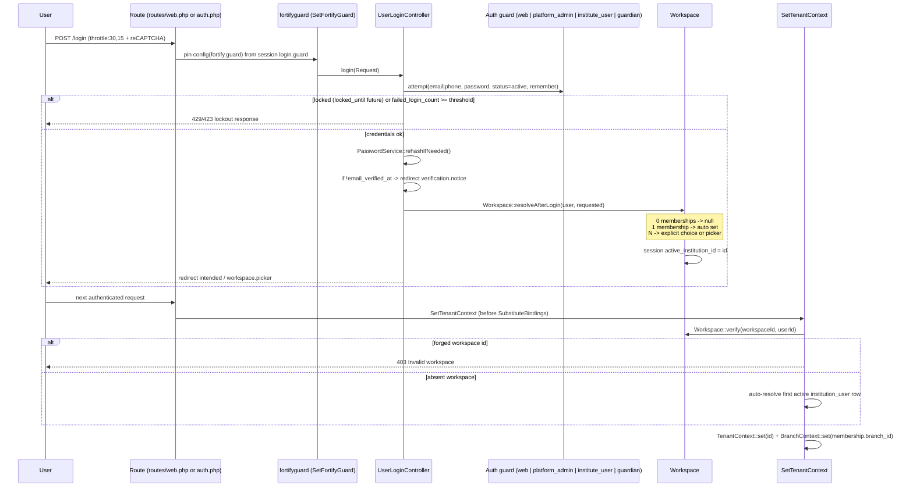
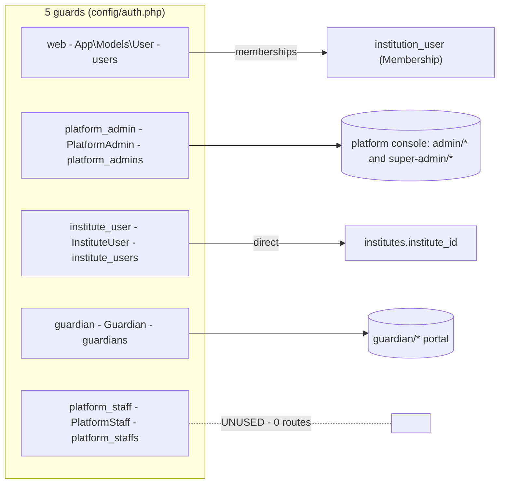
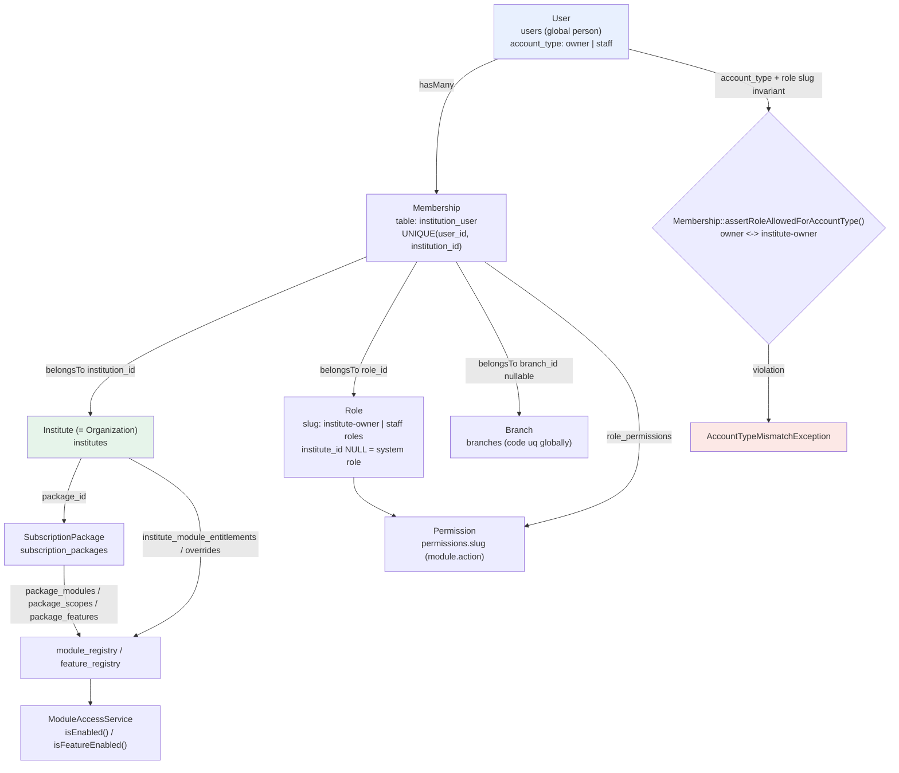
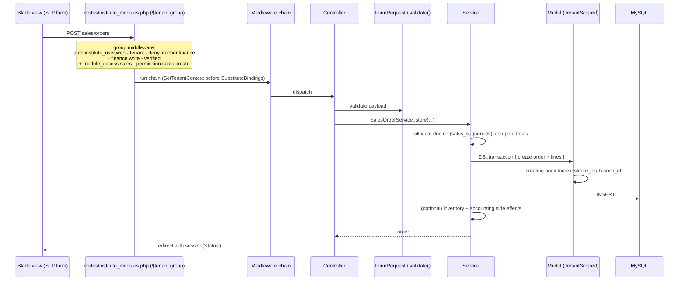
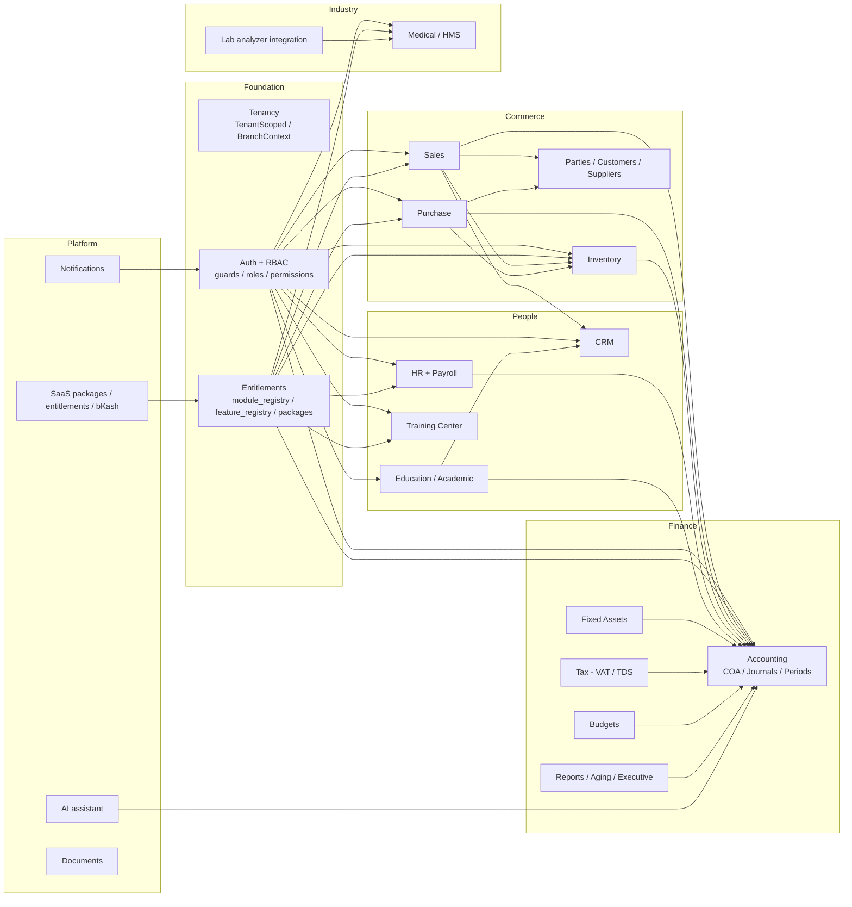
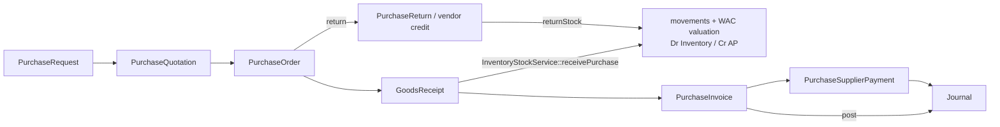
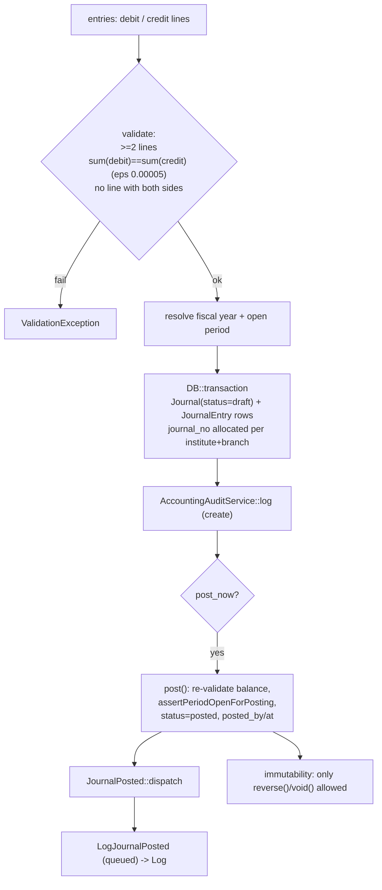
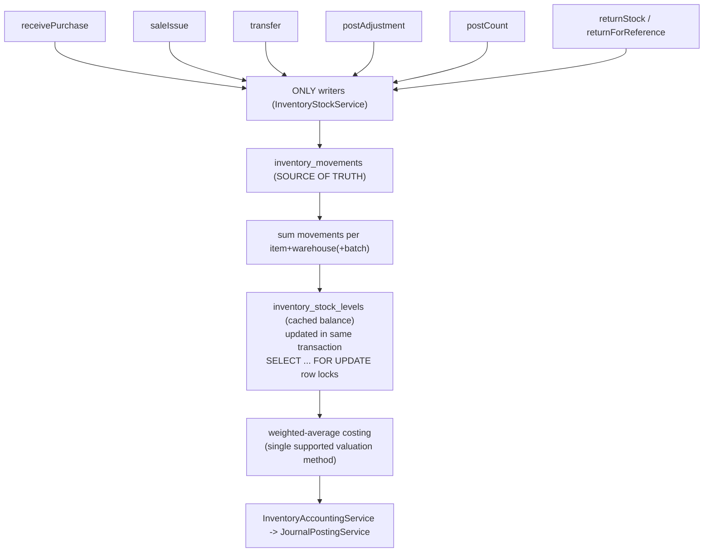
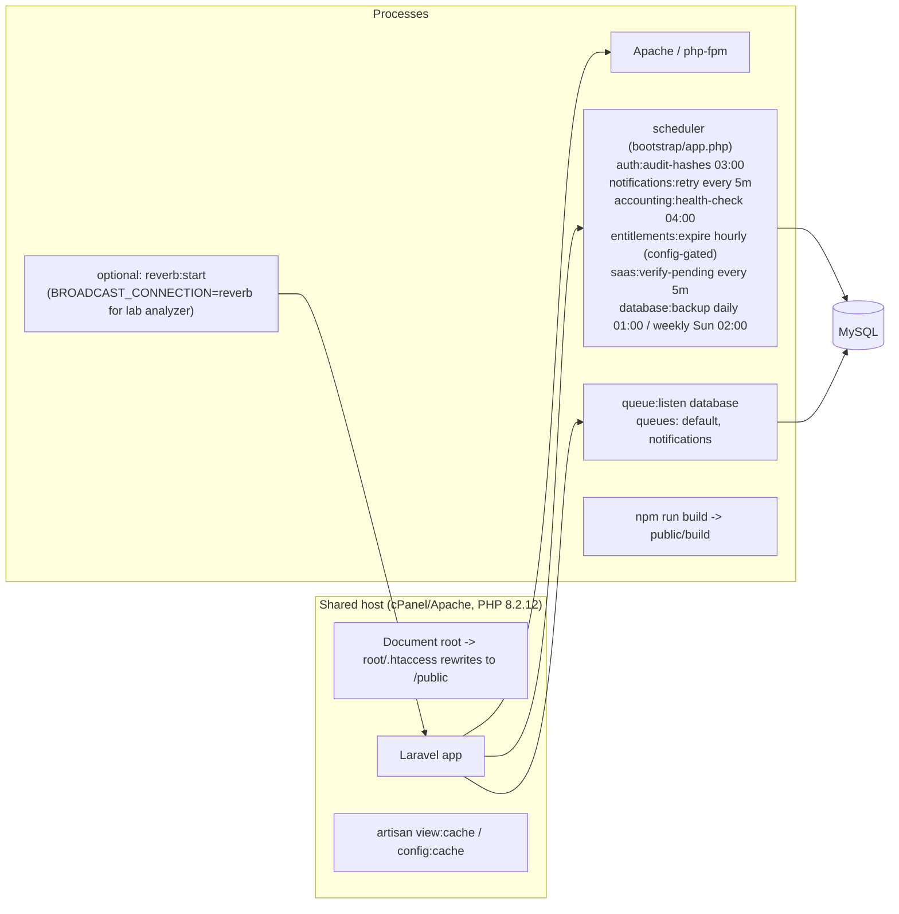

# ACCUMENAI — ARCHITECTURE DIAGRAMS

Evidence-based diagrams of the system as implemented. All claims traceable to files noted beneath each diagram.

---

## 1. System architecture

```mermaid
flowchart TB
    subgraph Clients
        B[Browser - Blade/Livewire/Alpine]
        R[React islands - 4 medical pages]
        M[Mobile app - Sanctum token]
        GA[Lab analyzer / gateway - lab.device auth]
    end

    subgraph "Laravel 12 monolith (Apache / cPanel, PHP 8.2)"
        RT[Route files<br/>web.php - institute_modules.php - medical.php<br/>auth.php - guardian.php - api.php - channels.php]
        MW[Middleware<br/>SecurityHeaders - SetLocale - SetTenantContext<br/>auth guards - permission - module_access - feature<br/>deny.teacher.finance - finance.write - advanced.accounting - medical*]
        CT[358 Controllers]
        SV[392 Services<br/>business logic + transactions]
        LV[21 Livewire components]
        MD[421 Eloquent models<br/>TenantScoped / BranchScoped global scopes]
    end

    subgraph "Engines"
        JP[JournalPostingService<br/>double-entry, balance, periods]
        IS[InventoryStockService<br/>single stock write path, WAC]
        MA[ModuleAccessService<br/>package - feature - override resolution]
    end

    subgraph "Data"
        DB[(MySQL - 427 tables<br/>schema/mysql-schema.sql + 240 migrations)]
        Q[(database queue)]
        C[(cache: file/database)]
        S[(storage: local disk)]
    end

    subgraph "Async / realtime"
        QR[queue worker<br/>default, notifications]
        RV[Laravel Reverb<br/>lab analyzer broadcasts]
    end

    subgraph "External"
        AI[AI providers: Gemini / OpenAI / Anthropic]
        BK[bKash tokenized payments]
        SM[SMTP (Gmail)]
        RC[Google reCAPTCHA]
        DG[DGDA / RxNorm registries]
    end

    B --> RT
    R --> RT
    M --> RT
    GA --> RT
    RT --> MW --> CT --> SV --> MD --> DB
    CT --> LV --> MD
    SV --> JP --> DB
    SV --> IS --> DB
    SV --> MA
    SV -.dispatch.-> Q --> QR -.-> SV
    RV -.broadcast.-> R
    SV --> AI
    SV --> BK
    SV --> SM
    CT --> RC
    SV --> DG
```

**Evidence**: `composer.json`, `package.json`, `vite.config.js`, `bootstrap/app.php`, `routes/*`, `database/schema/mysql-schema.sql`, `config/reverb.php`.

---

## 2. Authentication flow



**Evidence**: `app/Http/Controllers/Auth/UserLoginController.php:47-233`, `app/Support/Workspace.php`, `app/Http/Middleware/SetTenantContext.php`, `app/Http/Middleware/SetFortifyGuard.php`, `bootstrap/app.php:44-67`.



---

## 3. Organization / membership flow



**Evidence**: `app/Models/User.php:205-218`, `app/Models/Membership.php`, `app/Models/Institute.php`, `app/Services/ModuleAccessService.php`, `database/schema/mysql-schema.sql`.

---

## 4. Multi-tenant data flow

```mermaid
flowchart TD
    REQ[HTTP request] --> A{Authenticated user type}
    A -->|Guardian| G1["TenantContext = user.institute_id<br/>BranchContext = clear (all branches)"]
    A -->|InstituteUser| G2["TenantContext = user.institute_id<br/>BranchContext = user.branch_id"]
    A -->|User (web)| G3["Workspace::verify(session active_institution_id)<br/>forged -> 403 / absent -> auto-resolve<br/>TenantContext = membership.institution_id<br/>BranchContext = membership.branch_id (null = all branches)"]
    A -->|none| G4["TenantContext = clear (scopes inactive)"]

    G1 & G2 & G3 --> SB["SubstituteBindings (reordered AFTER tenant)"]
    SB --> Q["Eloquent query on model with TenantScoped"]
    Q --> SC{"TenantContext::enabled()?"}
    SC -->|no| NOOP["NO-OP: all rows visible<br/>(CLI, platform admin)"]
    SC -->|yes| WHERE["WHERE institute_id = TenantContext::id()<br/>(hybrid: OR institute_id IS NULL AND is_system=1)"]
    WHERE --> BC{"BranchScoped + BranchContext enabled?"}
    BC -->|yes| BW["AND branch_id = BranchContext::id()"]
    BC -->|no (owner/admin)| ALLB["all branches of tenant"]

    CREATE[Model::create] --> HOOK["creating hook:<br/>force institute_id = context<br/>updating hook: revert institute_id / created_by"]
    HOOK --> DB[(MySQL)]

    style NOOP fill:#fce8e6
    style HOOK fill:#e6f4ea
```

**Where isolation IS enforced**
- `bootstrap/app.php:101` middleware priority.
- `app/Models/Concerns/TenantScoped.php:19-68` (scope + create/update hooks).
- `app/Models/Concerns/BranchScoped.php:24-48`.
- `app/Http/Middleware/EnsureInstituteContext.php` (API).
- 223 of 421 model files use `TenantScoped`.
- `SystemTenantIsolationAudit` command + `TenantIsolationAuditTest`, `Phase18BranchIsolationTest`.

**Where it is NOT framework-enforced (manual only)**
- All 76 `app/Models/Medical/*` models — 0 global scopes; controllers call `MedicalScope::instituteId()` (52 files reference it; e.g. `PatientController.php:68,207,302,463`).
- Line-item models (`InvoiceItem`, `SalesOrderLine`, `PurchaseInvoiceItem`, …) — scoped via parent only.
- Any code using `withoutGlobalScopes()` must re-filter manually (`SalesInventoryIntegration`, `CheckModuleAccess`, `CheckFeatureAccess`).
- Routes lacking the `tenant` middleware would run with disabled context (tenant groups that declare `auth` but not `tenant` are the risk surface).

---

## 5. Request lifecycle (tenant CRUD example)



---

## 6. Major module relationships



**Dependency rules observed in code**: financial effects always funnel through `JournalPostingService`; stock effects always funnel through `InventoryStockService`; entitlement checks always funnel through `ModuleAccessService`.

---

## 7. Business workflows

### 7a. Sales cycle

```mermaid
flowchart LR
    L[Lead<br/>sales/leads] -->|convert| Q[SalesQuotation<br/>+ lines]
    Q -->|convert| O[SalesOrder<br/>states: draft submitted approved<br/>processing ready completed cancelled rejected]
    O -->|create| D[SalesDelivery]
    D -->|confirm| DI["InventoryStockService::saleIssue<br/>movements + stock_levels + COA"]
    D -->|invoice| IV[Invoice + InvoiceItems]
    IV -->|postJournal| JR[Journal posted<br/>Dr AR / Cr Revenue (+Tax)]
    IV -->|payment| P[Payment]
    Q -.->|also direct| IV
    O -.->|storeForOrder| IV
    IV -->|return| RT["SalesReturn / credit-memo<br/>approve post refund reverse"]
    RT -->|returnStock| IV
    RT -->|journal reversal| JR
```

**Evidence**: `routes/institute_modules.php` sales groups; `app/Services/Sales/*` (13 services); `app/Services/Accounting/InvoiceService.php:50-362` (`create`, `issueInventoryStock`, `postJournal`, `cancel`).

### 7b. Purchase cycle



**Evidence**: `app/Services/Purchase/*` (10 services), `PurchaseAccountingService`.

### 7c. Journal posting (double-entry)



**Evidence**: `app/Services/Accounting/JournalPostingService.php:36-130+`, `app/Events/JournalPosted.php`, `app/Listeners/LogJournalPosted.php`.

### 7d. Inventory stock



**Evidence**: `app/Services/Inventory/InventoryStockService.php` class docblock + 8 public methods; grep shows it is the only file creating `InventoryMovement`.

---

## 8. Database relationship overview

```mermaid
erDiagram
    users ||--o{ institution_user : "memberships (user_id)"
    institutes ||--o{ institution_user : "institution_id"
    roles ||--o{ institution_user : "role_id"
    branches ||--o{ institution_user : "branch_id (nullable)"
    roles ||--o{ role_permissions : ""
    permissions ||--o{ role_permissions : ""
    institutes ||--o{ branches : ""
    institutes ||--o{ subscription_packages : "package_id"
    subscription_packages ||--o{ package_modules : ""
    institutes ||--o{ institute_module_entitlements : ""
    institutes ||--|| institute_settings : ""

    institutes ||--o{ students : ""
    students ||--o{ student_enrollments : ""
    batches ||--o{ student_enrollments : ""
    institutes ||--o{ parties : ""
    parties ||--o{ sales_quotations : ""
    sales_quotations ||--o{ sales_orders : "convert"
    sales_orders ||--o{ sales_deliveries : ""
    sales_deliveries ||--o{ invoices : ""
    parties ||--o{ invoices : ""
    invoices ||--o{ invoice_items : ""
    invoices ||--o{ payments : ""
    invoices ||--o{ sales_returns : ""
    institutes ||--o{ purchase_orders : ""
    purchase_orders ||--o{ goods_receipts : ""
    goods_receipts ||--o{ purchase_invoices : ""
    purchase_invoices ||--o{ purchase_supplier_payments : ""

    institutes ||--o{ inventory_items : ""
    inventory_items ||--o{ inventory_movements : ""
    inventory_warehouses ||--o{ inventory_stock_levels : ""
    inventory_items ||--o{ inventory_stock_levels : ""
    inventory_batches ||--o{ inventory_movements : ""

    institutes ||--o{ chart_of_accounts : "nullable = global hybrid"
    chart_of_accounts ||--o{ journal_entries : "coa_id"
    institutes ||--o{ journals : ""
    journals ||--o{ journal_entries : ""
    fiscal_years ||--o{ accounting_periods : ""
    journals ||--o{ accounting_periods : "period_id"

    institutes ||--o{ hr_employees : ""
    hr_employees ||--o{ hr_payrolls : ""
    hr_payroll_periods ||--o{ hr_payrolls : ""

    institutes ||--o{ patients : "manual scope"
    patients ||--o{ medical_encounters : ""
    patients ||--o{ prescriptions : ""
    prescriptions ||--o{ prescription_items : ""
    patients ||--o{ lab_orders : ""

    institutes ||--o{ crm_contacts : ""
    institutes ||--o{ documents : ""
    institutes ||--o{ notification_templates : ""
```



**Notes**
- `institution_user` is the Membership table (singular name, legacy pivot naming).
- `institute_users` (plural) is the separate legacy login realm — **not shown above to avoid confusion**.
- `chart_of_accounts.institute_id` is nullable for the hybrid global COA (`is_system = 1`).
- All `institute_id` FKs are the tenancy axis; `branch_id` is a secondary axis on branch-owned tables.

---

## 9. Deployment / runtime architecture



**Evidence**: `bootstrap/app.php:106-167`, `composer.json` scripts (`setup`, `dev`, `test`), `.htaccess`, `docs/cpanel-2gb-optimization/`, `scripts/*.sh`.
