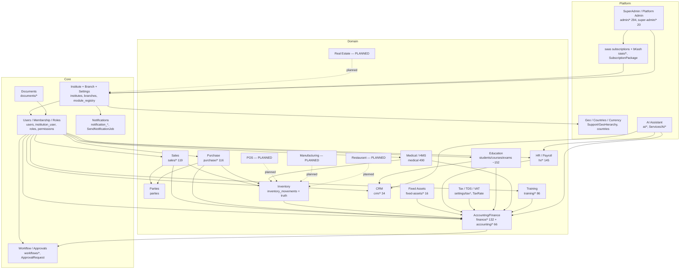
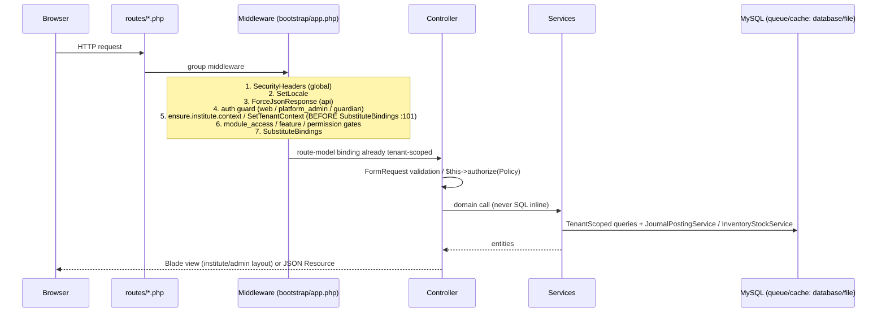
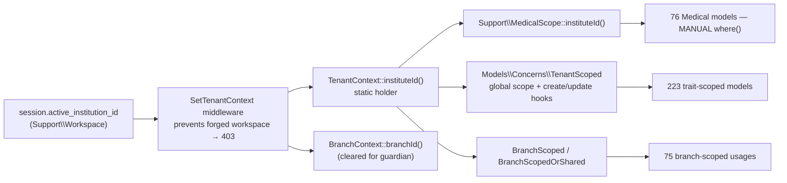
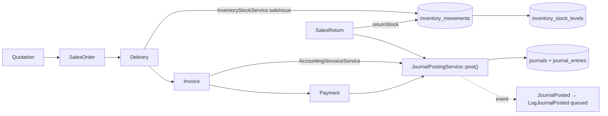
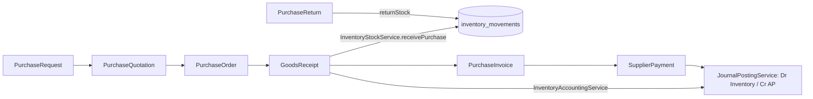
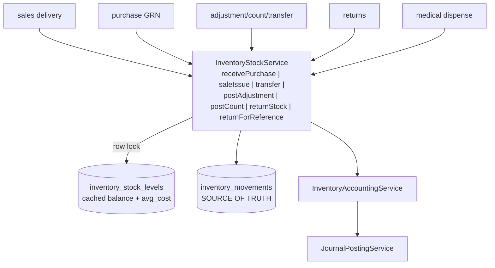
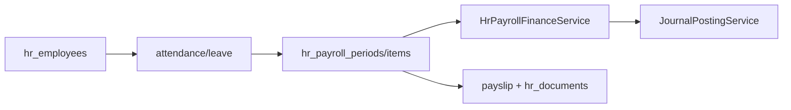
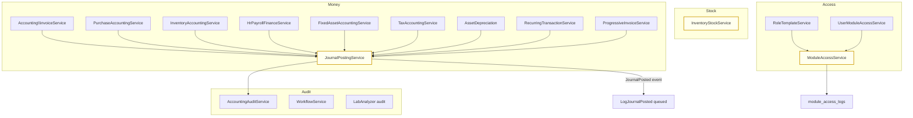
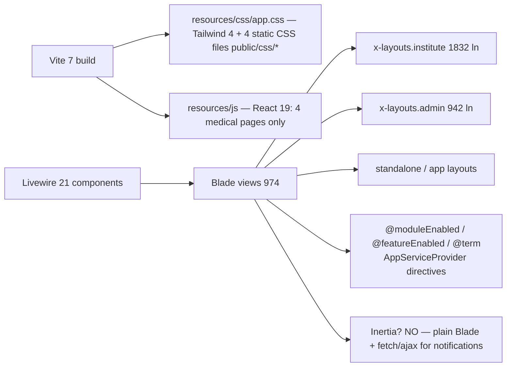

# ACCUMENAI — SYSTEM KNOWLEDGE GRAPH

Node/edge maps of the system: module dependencies, core data flow, tenancy chain, and the central domain entities. Evidence = file paths (or route prefix + table names from `database/schema/mysql-schema.sql`).

---

## 1. Module dependency graph

Legend: solid `-->` = implemented hard dependency; dotted `-.->` = PLANNED (config + registry migrations only, zero routes).

---

## 2. Request → context → authorization pipeline

Guard selection: `SetFortifyGuard` + `config/auth.php` (5 guards; `platform_staff` unused).

---

## 3. Tenancy & workspace chain

Key facts:
- Column: `institute_id` everywhere (`organization_id` does not exist).
- Trait hooks force `institute_id`/`created_by` on create and revert tampering on update.
- Medical: no global scope — enforcement by convention (`MedicalScope` used in 52 files).
- Session workspace = `active_institution_id`; mismatch/forge → 403.

---

## 4. Core transaction flows

### 4a. Sales order → cash

### 4b. Purchase → stock + AP

### 4c. Inventory write path (single choke point)

### 4d. HR payroll → finance

---

## 5. Central entities & relationships

```mermaid
erDiagram
  INSTITUTE ||--o{ BRANCH : has
  INSTITUTE ||--o{ MEMBERSHIP : "institution_user"
  USER ||--|| MEMBERSHIP : "account_type owner|staff"
  MEMBERSHIP }o--|| ROLE : "one role per session"
  ROLE }o--o{ PERMISSION : role_permissions
  USER ||--o{ USER_MODULE_ACCESS : "user_module_access"
  INSTITUTE ||--o{ INSTITUTE_MODULE_ENTITLEMENT : module_registry
  INSTITUTE ||--o{ INSTITUTE_FEATURE_OVERRIDE : "feature overrides"

  INSTITUTE ||--o{ PARTY : "parties"
  PARTY ||--o{ INVOICE : "sales"
  PARTY ||--o{ PURCHASE_INVOICE : "purchase"
  INVOICE ||--o{ INVOICE_ITEM : lines
  INVOICE ||--o{ PAYMENT : received
  PURCHASE_INVOICE ||--o{ GOODS_RECEIPT : "GRN"
  INVENTORY_ITEM ||--o{ INVENTORY_STOCK_LEVEL : "per warehouse"
  INVENTORY_ITEM ||--o{ INVENTORY_MOVEMENT : "truth"
  INVENTORY_WAREHOUSE ||--o{ INVENTORY_STOCK_LEVEL : has
  CHART_OF_ACCOUNT ||--o{ JOURNAL_ENTRY : "via journals"
  JOURNAL ||--o{ JOURNAL_ENTRY : lines
  FISCAL_YEAR ||--o{ ACCOUNTING_PERIOD : periods

  STUDENT ||--o{ STUDENT_ENROLLMENT : enrolls
  BATCH ||--o{ STUDENT_ENROLLMENT : has
  COURSE ||--o{ BATCH : offers
  STUDENT ||--o{ EXAM_RESULT : results
  PATIENT ||--o{ APPOINTMENT : books
  PATIENT ||--o{ MEDICAL_ENCOUNTER : visits
  MEDICAL_ENCOUNTER ||--o{ PRESCRIPTION : writes
  LAB_ORDER ||--o{ LAB_RESULT : "analyzer via Reverb"
  EMPLOYEE ||--o{ HR_ATTENDANCE : tracks
  EMPLOYEE ||--o{ HR_PAYROLL_ITEM : paid
  LEAD ||--o{ CRM_ACTIVITY : "crm_leads"
  DOCUMENT ||--o{ DOCUMENT_VERSION : versions
  WORKFLOW ||--o{ WORKFLOW_STEP : steps
  APPROVAL_REQUEST ||--o{ APPROVAL_STEP : gates
```

Notes:
- `MEMBERSHIP` = model `Membership`, **table `institution_user`**, FK `institution_id`.
- `CHART_OF_ACCOUNT` rows are hybrid: `institute_id NULL AND is_system=1` (global) + tenant rows.
- Cross-module FKs are discipline-based: e.g. sales `invoices`/`parties` ↔ finance journals are linked by `journal` posting references, not hard FKs — verify per migration.

---

## 6. Cross-cutting service graph

---

## 7. Event / job / schedule graph

| Trigger | Event/Job | Where |
|---|---|---|
| Journal posted | `JournalPosted` → `LogJournalPosted` (queued) | `JournalPostingService.php:103` |
| Email verification | `QueuedVerifyEmail` notification (queued) | `Auth/*` |
| Notification send | `SendNotificationJob` | `Support/NotificationCenter` |
| Analyzer result | `LabAnalyzerResultStored` + Reverb broadcast | `LabIntegration/*` |
| Depreciation run | `DepreciationRunJob` | `FixedAsset/*` |
| Every 5 min | `notifications:retry` schedule | `bootstrap/app.php` schedule |
| Every minute | `payment-gateway:verify-pending`, entitlement expiry, queue work | `bootstrap/app.php` |
| Daily/weekly | `ProcessExpiredGrants`, `EntitlementsExpire`, `auth:audit-hashes`, archive/report jobs | `bootstrap/app.php` |
| `InvoicePaid` event | **NEVER dispatched** (listener dead) | `app/Events/InvoicePaid.php` |
| `AuditActivityLog` middleware | **NEVER registered** | `app/Http/Middleware/AuditActivityLog.php` |

Queue: `config/queue.php` → `database` driver (`jobs`/`failed_jobs` tables). Cache: `file` (local). Sessions: `database`.

---

## 8. Frontend rendering graph

---

## 9. Trust boundaries

1. **Public**: login, register, password reset, geo lookup, verification callbacks → throttled + reCAPTCHA.
2. **Institute session**: `web`/`institute_user` guards, tenant-scoped, RBAC-gated.
3. **Guardian session**: separate guard, branch context cleared, own-children only.
4. **Platform admin**: `platform_admin` guard, cross-tenant by design (super-admin destructive routes are the most sensitive in the app).
5. **API**: `auth:sanctum` tokens + `ensure.institute.context` + rate limit 60/min.
6. **Devices**: lab analyzers via separate credential tables (`lab_integration.device_credentials`), queued parsing.
7. **Webhooks**: bKash callback `/saas/callback` with webhook secret — signature-verified.

---

## 10. Dead / dangling nodes (present in graph but disconnected)

- `AuditActivityLog` middleware → 0 registrations.
- `InvoicePaid` event + `LogInvoicePaid` listener → 0 dispatches.
- `SalesInventoryIntegration` service → 0 callers.
- `platform_staff` guard → 0 routes.
- `LegacyUser` model → usage unverified (treat as legacy).
- POS / Manufacturing / Real Estate / Restaurant configs + registry migrations → 0 routes/controllers/models (PLANNED nodes, dotted in §1).
